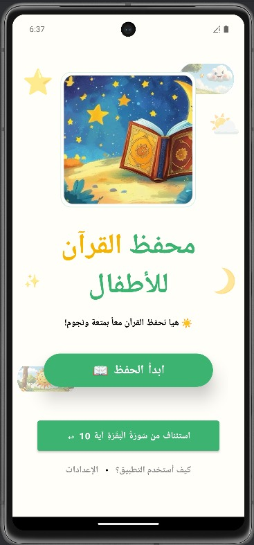
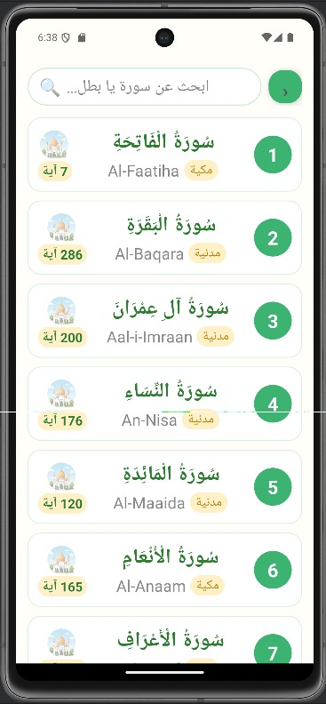
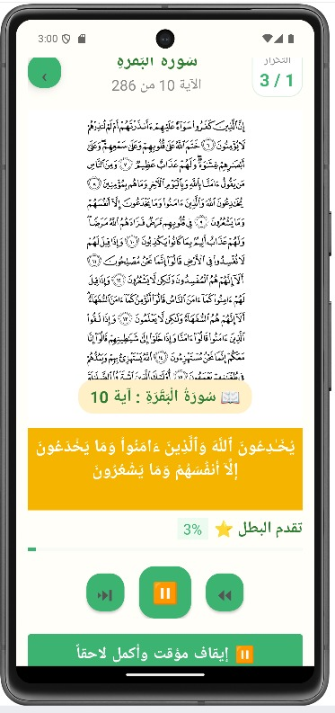

# Little Quran Stars — Quran Memorization App for Kids

## Overview
Little Quran Stars is an Android application designed to help children memorize the Holy Quran through an engaging, interactive experience. Users select a verse range from any Surah, configure the number of repetitions per verse, and listen to audio recitation while viewing the corresponding Mushaf page.

## Preview

  
  
  

## Features
- Select any Surah from all 114 Surahs of the Holy Quran
- Configure verse range and custom repetition count per verse
- Audio playback with 7 different reciters
- Real-time Mushaf page display
- Progress saving and resume functionality
- Night mode and font size settings
- Quiz mode after memorization sessions

## Tech Stack
Java · Android SDK 34 · SQLite · AlQuran Cloud API · MediaPlayer · ViewPager2 · RecyclerView

## Files in This Repo
- `app/` — full Android Studio project source code
- `Little_Quran_Stars_Report.pdf` — full project report (screens, database schema, API integration, navigation flow)
- `screenshots/` — app UI previews

## My Contribution
This project was developed by a team of four students as part of the Mobile Application Development course. I led the project and was responsible for the majority of the implementation:
- Designed and implemented all 8 screens (UI/UX) with RTL support and consistent theming
- Built the SQLite database (DatabaseHelper, verses & user_progress tables, CRUD functions)
- Integrated the AlQuran Cloud API for verse text, audio, and Mushaf page numbers

## License
MIT License - Feel free to use this for educational purposes.
